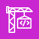

# デプロイに関係する  AWS サービス

## AWS CodePipeline

https://ap-northeast-1.console.aws.amazon.com/codesuite/codepipeline/start?region=ap-northeast-1

ソフトウェアリリースプロセスのさまざまな段階を視覚化して自動化する

AWS CodePipeline は継続的統合と継続的デリバリーのためのサービスで、アプリケーションとインフラストラクチャを短時間かつ信頼性の高い方法でアップデートできます。CodePipeline では、コード変更があるたびに、定義されたリリースプロセスモデルに基づいてコードを構築、テスト、デプロイします。

## AWS CodeBuild

https://ap-northeast-1.console.aws.amazon.com/codesuite/codebuild/start?region=ap-northeast-1

伸縮自在なスケーリングでコードをビルドおよびテストします。使用したビルド時間のみのお支払いです。

AWS CodeBuild は完全マネージド型の継続統合サービスです。ソースコードのコンパイル、テストの実行、すぐにデプロイできるソフトウェアパッケージの生成を行います。CodeBuild により、ビルドサーバーのプロビジョニング、管理、スケーリングが不要になります。CodeBuild は連続的にスケールされ、複数のビルドが同時に処理されるので、ビルドが待機状態でキュー内に残されることがありません。

## Amazon Elastic Container Registry(ECR)

コンテナソフトウェアをパブリックまたはプライベートで共有およびデプロイ

Amazon Elastic Container Registry (ECR) は、コンテナイメージやアーティファクトをどこからでも簡単に保存、管理、共有、およびデプロイできる、完全マネージド型のコンテナレジストリです。

https://ap-northeast-1.console.aws.amazon.com/ecr/private-registry/repositories?region=ap-northeast-1

## 利用終了したサービス

### AWS Cloud9

コードの書き込み、実行、デバッグ用のクラウド IDE

AWS Cloud9 では、ブラウザだけでコードの書き込み、実行、デバッグを行えます。AWS Cloud9 を使用して、豊富なコードエディタ、統合デバッガー、事前設定された AWS CLI を備えた組み込みターミナルにすぐにアクセスできます。数分で使用を開始でき、ローカルアプリケーションのインストールや開発マシンの設定に時間を費やす必要はもうありません。

https://ap-northeast-1.console.aws.amazon.com/cloud9control/home?region=ap-northeast-1#/product

### AWS CodeCommit

クラウド上でコードを共有するための安全なリポジトリを作成します

AWS CodeCommit は、全面的に管理されたソース制御サービスで、企業は高い安全性とスケーラビリティを持つプライベート Git リポジトリを容易にホストできます。CodeCommit を使用することにより、独自のソース管理システムを運用したり、そのインフラストラクチャのスケーリングについて心配したりする必要がなくなります。

https://ap-northeast-1.console.aws.amazon.com/codesuite/codecommit/start?region=ap-northeast-1